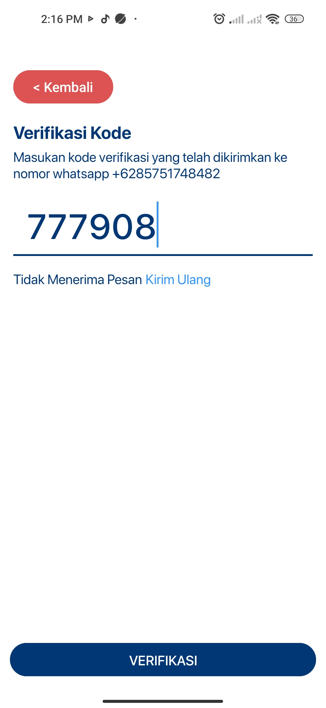
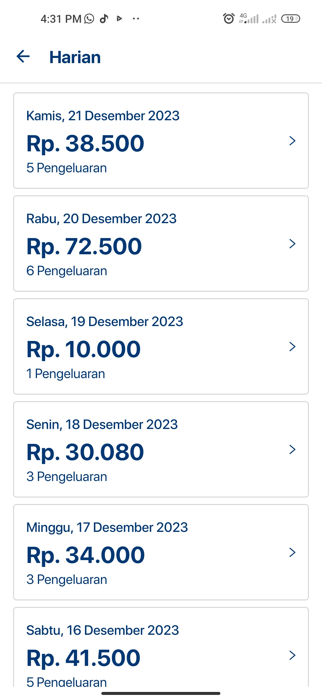

# Catatmak Mobile Android App

Catatmak Mobile Android App is designed to assist users in managing their finances easily and effectively. The application utilizes the [Catatmak Web Service API](https://github.com/Catatmak/catatmak-api) and [Catatmak Machine Learning API](https://github.com/Catatmak/catatmak-machine-learning-api) to extract text from receipt photos, categorize transactions automatically, provide financial insights through Mamih AI, and offer financial summaries across various periods.

## Key Features:
1. **Record Finances via Receipt Photos:** Upload photos of your receipts, and the application will generate corresponding transaction text items extracted from the receipts.
2. **Automatic Categorization:** Manually inputting categories while recording finances via WhatsApp can be cumbersome. Hence, we've implemented an automatic categorization feature.
3. **Insights by Mamih AI:** Mamih AI offers insights into your financial health, aiming to encourage wiser financial management.
4. **Financial Summaries:** Receive comprehensive financial summaries on a daily, weekly, and monthly basis.

## Screenshots
<p align="center">
  
  
  
  
</p>

<p align="center">
  
  
  
</p>


<p align="center">
  
  
  
  
  
</p>

<p align="center">
  
  
</p>

<p align="center">
  
  
  
  
</p>


## Requirements
- Android device with a minimum version of Android 7.0 (Nougat / API level 24).
- Emulator / External Device
- USB Cable (to Connect Android Device to your Computer)

## Development
- Developed using Kotlin.
- Targets Android API level 33.
- Application design done using Figma. [Click here](https://www.figma.com/file/Ycs1LdhAS93rIdGyiGw0RC/Catatmak-Apps?type=design&node-id=0-1&mode=design&t=fBJz4L2AelMZCpYL-0)

## Libraries Used
- Retrofit
- Glide
- Navigation
- DataStore-preference
- MPAndroidChart
- ViewModel and LiveData
- ViewPager2

## Installation
1. Clone the repository using the following command:
    ```
    git clone https://github.com/Catatmak/catatmak-mobile-android.git
    ```
2. Open Android Studio and select "Open an Existing Project."
3. Browse to the directory where you cloned your project and select the "Meongku" folder.
4. After opening the project, click on Run > Run 'app'.
5. Select the device or emulator to run the app, then click OK.
6. Once installed and running successfully, access the app through an emulator or your Android device.

Thank you for using Catatmak Mobile Android App!
